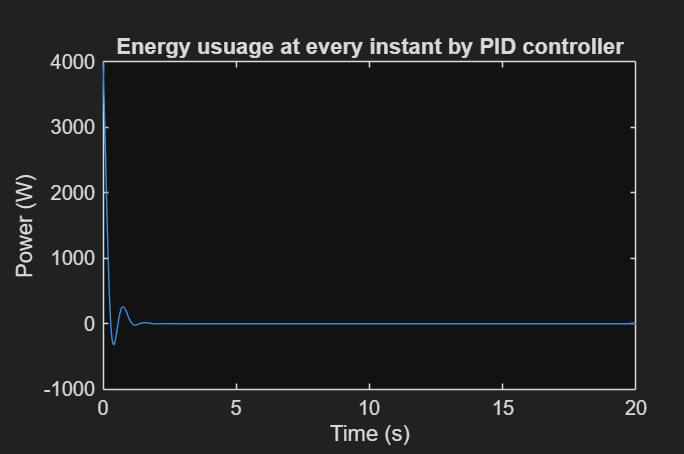
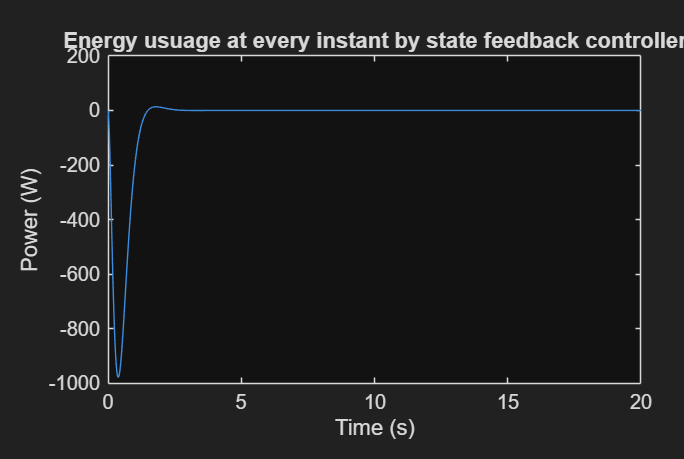
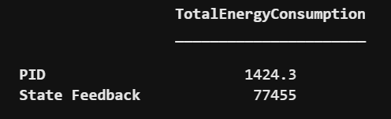

# Energy-Efficient Altitude Control for Small UAVs
## PID vs. State-Feedback Comparison

This project evaluates and compares classical and modern control approaches for UAV altitude stabilization. We implement a **PID Controller** and a **Full-State Feedback Controller** to analyze the trade-off between settling performance and control energy consumption.

---

## Project Overview
The primary objective is to analyze how different controllers affect the energy efficiency of a quadrotor's altitude system. While modern control often provides superior tracking, which comes with a cost of higher instantaneous power requirements.

### Problem Statement
The UAV must reach a desired altitude of $z_d = 10\text{m}$ from a state of rest. Both controllers are applied to the same plant model to ensure a fair comparison of:
* **Performance Metrics:** Rise time, overshoot, and settling time.
* **Energy Metrics:** Total control effort and instantaneous power.

---

## System Modeling

### Plant Model
The system is modeled in state-space form where the state vector is $x = [z, \dot{z}]^T$:

$$
A = \begin{bmatrix} 0 & 1 \\  0 & 0 \end{bmatrix}, \quad B = \begin{bmatrix} 0 \\ 1/m \end{bmatrix}, \quad C = \begin{bmatrix} 1 & 0 \end{bmatrix}, \quad D = 0
$$

* **Mass ($m$):** $0.5\text{kg}$

---

## Controllers

### 1. Classical Controller: PID
The PID controller was designed using manual gain tuning to achieve stable hovering.
* **Parameters:** $K_p = 10$, $K_i = 5$, $K_d = 2$
* **Transfer Function:** $$G_{pid}(s) = \frac{K_d s^2 + K_p s + K_i}{s}$$

### 2. Modern Controller: State-Feedback
Designed using the **Pole Placement** method to force the system to meet specific damping and frequency requirements.
* **Design Targets:** $\zeta = 0.8$, $\omega_n = 3.5\text{ rad/s}$
* **Desired Poles:** $-2.83 \pm 2.1j$
* **Tracking:** A feedforward gain ($k_d$) was computed using the `dcgain` method to ensure zero steady-state error.

---

## Energy & Power Analysis
To quantify "efficiency," we calculate the total control energy ($E$) and instantaneous power ($P$):

* **Total Energy:** $E = \int U(t)^2 \, dt$
* **Instantaneous Power:** $P(t) = u(t) \cdot \dot{z}(t)$

---

## Results & Key Insights

**Key Findings:**
* **State-Feedback** provides a significantly faster response and tighter tracking compared to PID.
* **Faster Response** is directly correlated with higher energy consumption; the "aggressive" pole placement requires more battery power.
* **PID** produces a smoother control action, which may reduce mechanical wear on the UAV's brushless motors.

---

##  Files
* [Source Code](src/Code.m)
---
